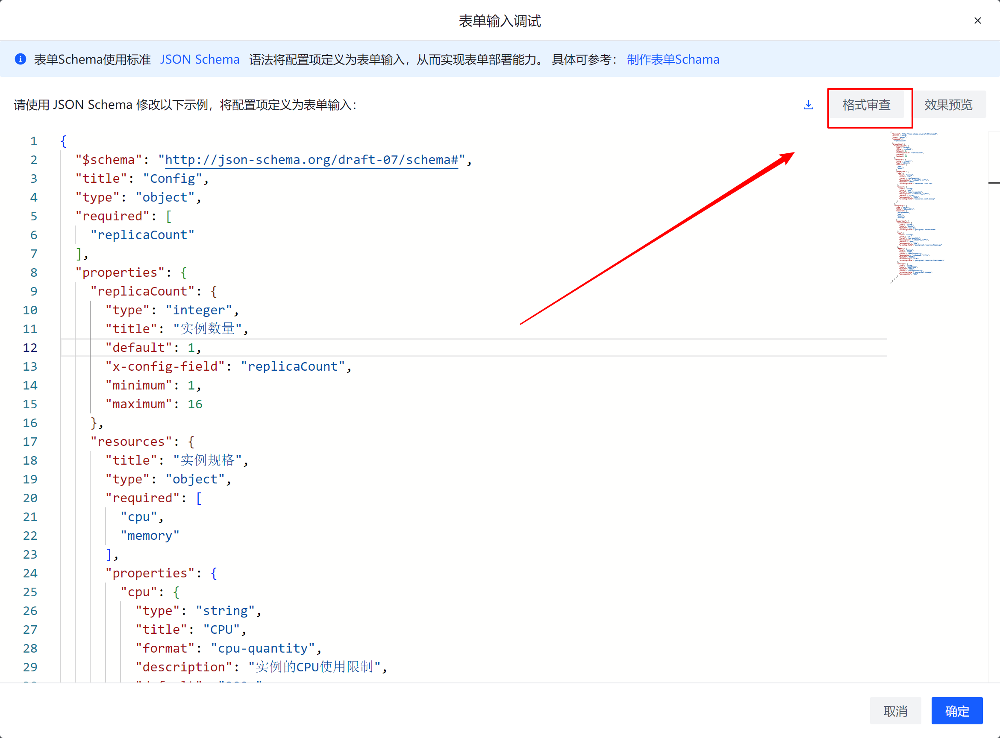
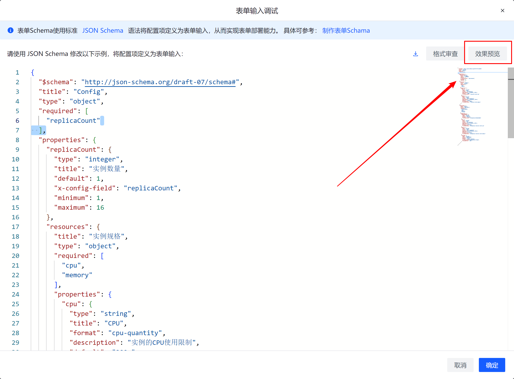

:::tip[提示]

表单Schema使用标准JSON Schema语法将配置项定义为表单输入，从而实现表单部署能力。

:::

## 开始之前

在开始上传之前，你需要对[【**JSON Schema**】](https://json-schema.org/)语法有一定的了解。


## 简单示例

- `title`对应表单中的一个表单项的Label。
- `description`对应表单项的提示消息。
- `default`对应表单项的默认值。
- `x-config-field`对应values.yaml中的一个配置项路径。
- `format`取值为cpu-quantity、memory-quantity、storage-quantity时，分别可用于配置CPU、内存、卷容量。

  `min-quantity`仅支持format为cpu-quantity、memory-quantity、storage-quantity的string对象，用于配置最小资源用量。
- 可以使用`minLength`和`maxLength`关键字来限制字符串的长度。对于这两个关键字，该值必须是非负数。

```json
{
  "$schema": "http://json-schema.org/draft-07/schema#",
  "title": "Config",
  "type": "object",
  "properties": {
    "resources": {
      "title": "实例规格",
      "type": "object",
      "required": [
        "cpu",
        "memory",
        "pvcSize"
      ],
      "properties": {
        "cpu": {
          "type": "string",
          "title": "CPU",
          "format": "cpu-quantity",
          "description": "实例的CPU使用限制",
          "default": "200m",
          "x-config-field": "resources.limit.cpu"
        },
        "memory": {
          "type": "string",
          "title": "内存",
          "format": "memory-quantity",
          "description": "实例的内存使用限制",
          "default": "512Mi",
          "min-quantity": "256Mi",
          "x-config-field": "resources.limit.memory"
        },
        "pvcSize": {
          "type": "string",
          "title": "卷容量",
          "default": "10Gi",
          "format": "storage-quantity",
          "x-config-field": "persistence.size",
          "min-quantity": "1Gi"
        }
      }
    }
  }
}
```

## 格式审查

打开表单输入调试窗口：控制台=>应用市场=>发布应用=>选择包类型为【Chart】=> 表单Schama，在线编辑。



## 效果预览

打开表单输入调试窗口：控制台=>应用市场=>发布应用=>选择包类型为【Chart】=> 表单Schama，在线编辑。

