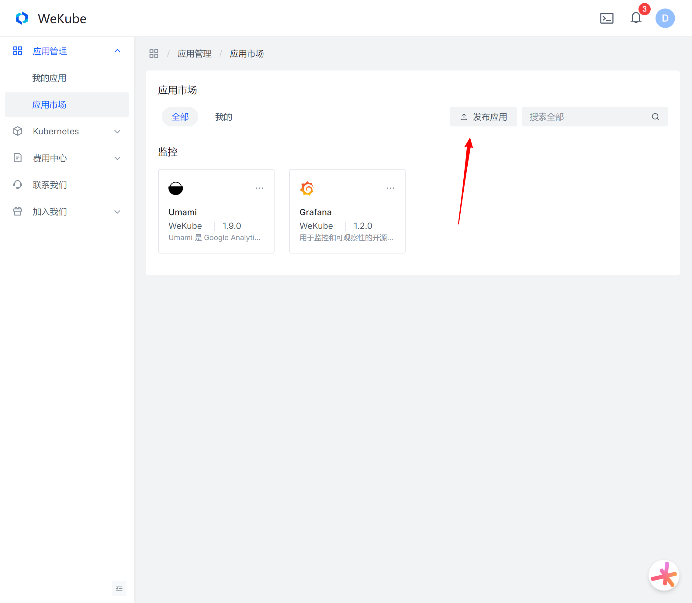
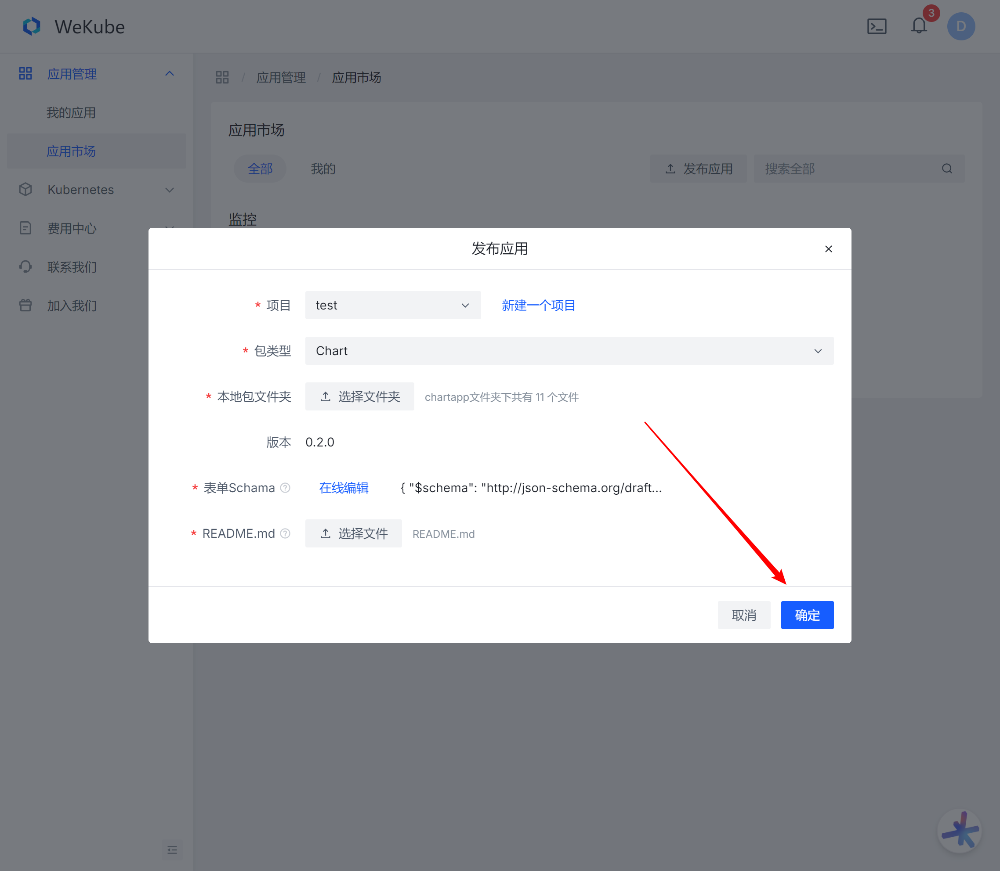

用户不仅可以一键部署预置的应用模板，还可以根据自己的需求定制部署方案，并可以将应用分享给到应用市场，开放给其它用户使用，共同推动整个生态系统的繁荣发展。

:::tip[提示]

- 目前仅支持Helm chart格式的应用安装包。

- 上传应用即可获得消费返利，详见[开发返利](https://wekube.com/zh-Hans/joinus/publish)。

:::

## 开始之前

在开始上传之前，请确保你的应用程序已经完成了以下步骤：

- **测试**：确保你的应用程序在目标设备上进行了充分的测试，并且没有明显的bug。
- **设计**：应用程序的界面应当符合用户的使用习惯，同时也要遵守平台的设计指南。
- **说明文档**：准备应用的截图以及清晰的应用描述，以便用户了解应用的功能和特点。
- **图标**：准备好应用的图标。

## 提交应用

1. 首先进入[【应用市场】](https://wekube.com/zh-Hans/application/market)。

2. 编辑【发布应用】按钮。

   

3. 选择项目。

   > 如果项目不存在，请点击【新建一个项目】，创建要给项目。

   

4. 选择包类型为【Chart】。

5. 选择Chart包文件夹。

   :::tip[提示]

   选择的Chart包名称必须与项目名称一致，但是在比较时会忽略大小写、空格、-符号

   :::

6. 编辑表单Schama。[如何制作表单Schama](/docs/app-market/make-form-schama)。

7. 选择README.md文件。

8. 点击【确定】，完成上传。

## 注意事项

- 保持与用户的沟通，及时更新应用以修复bug或添加新功能，提高用户体验。