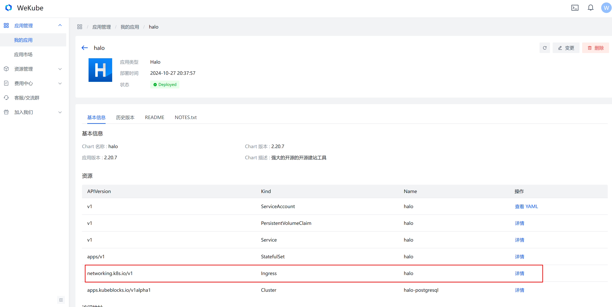
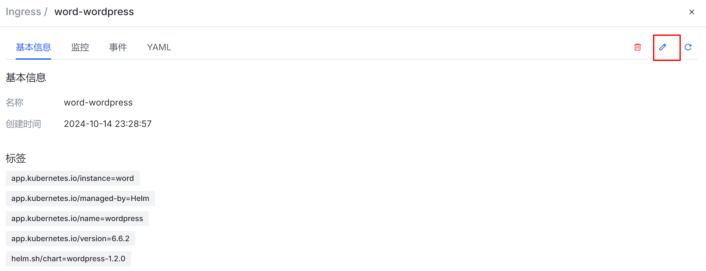

如果你需要使用自己的域名，WeKube也支持配置自定义域名，请参考以下步骤：

:::tip[提示]

部署区域选择在中国内地时，使用的域名需要先进行ICP备案；

部署区域选择在香港或国外内地时，无需备案。

:::

## 开始之前

:::tip[提示]

需要提前给要使用的域名添加一个CNAME类型的DNS记录，并解析到cname.hy.wekube.com。

:::

要检查一个CNAME类型的DNS记录是否已经生效，您可以按照以下方法：

- **使用命令行工具查询**：

   在Windows中可以使用`nslookup`命令。

   ```shell
   nslookup yourdomain.com
   ```

   在Unix/Linux或macOS系统中可以使用`dig`命令。

   ```shell
   dig yourdomain.com CNAME
   ```

   上述命令会显示与您域名相关的所有DNS记录。

- **使用在线DNS查询工具**：

   [WhatIsMyIP.com](https://www.whatismyip.com/dns-lookup/)

   选择类型为CNAME，输入您的自定义域名`https://yourdomain.com`，然后提交。

   - 如果已经生效就会直接显示；
   - 如果提示`no records found`就是还没有生效。

## 使用自定义域名

1. 首先进入应用详情页面。

2. 找到需要修改的Ingress对象，然后点击【详情】。

   

   

3. 点击【编辑】图标按钮。

   

4. 配置自定义域名

   - 删除 ingress.wekube.com/with-host注解，可保留ingress.wekube.com/with-ssl注解。详见[《使用Ingress注解》](/docs/quick-start/ingress-annotations)。
   - 修改rule中的host为您的自定义域名。
   - 删除tls字段，WeKube会自动为您添加。

   ```yaml
   apiVersion: networking.k8s.io/v1
   kind: Ingress
   metadata:
     annotations:
       ingress.wekube.com/with-ssl: 'true'
       nginx.ingress.kubernetes.io/ssl-redirect: 'true'
   spec:
     rules:
       - host: demo.example.com
         http:
           paths:
             - backend:
                 service:
                   name: word-wordpress
                   port:
                     number: 80
               path: /
               pathType: ImplementationSpecific
   ```

5. 点击【确认】提交，配置完成。

   > 配置提交后，系统需要一段时间来完成SSL证书申请。

## 注意事项

- 【变更】应用后，Ingress会被重置，需要重新配置。

   :::tip[提示]
   如果您有更好的方法和建议，请[联系我们](https://wekube.com/zh-Hans/contactus)。
   :::