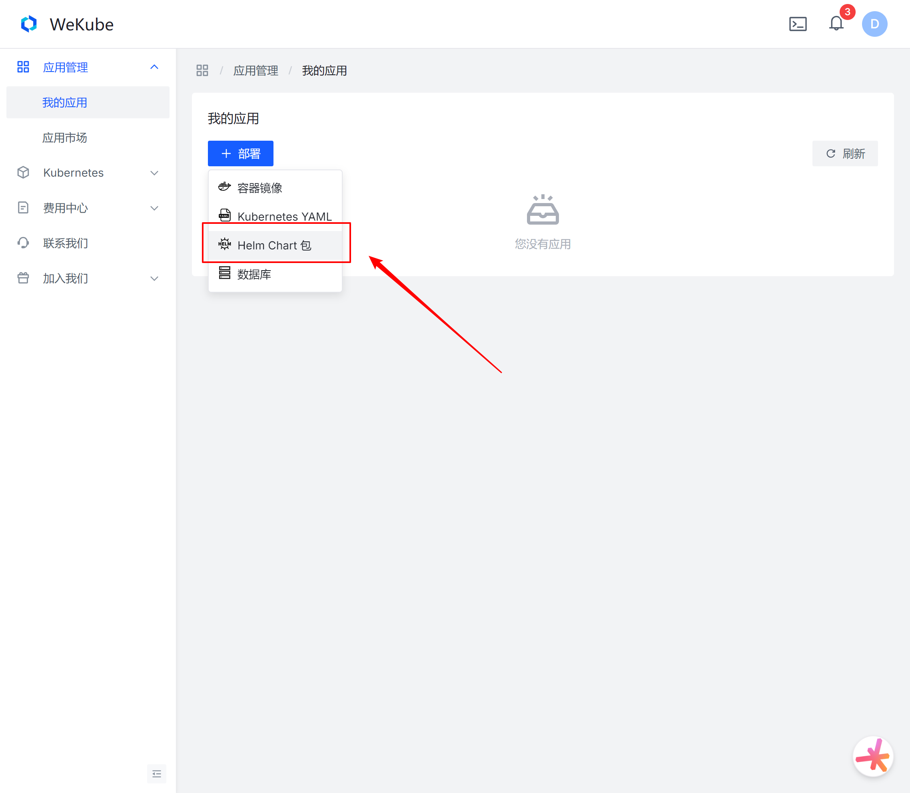
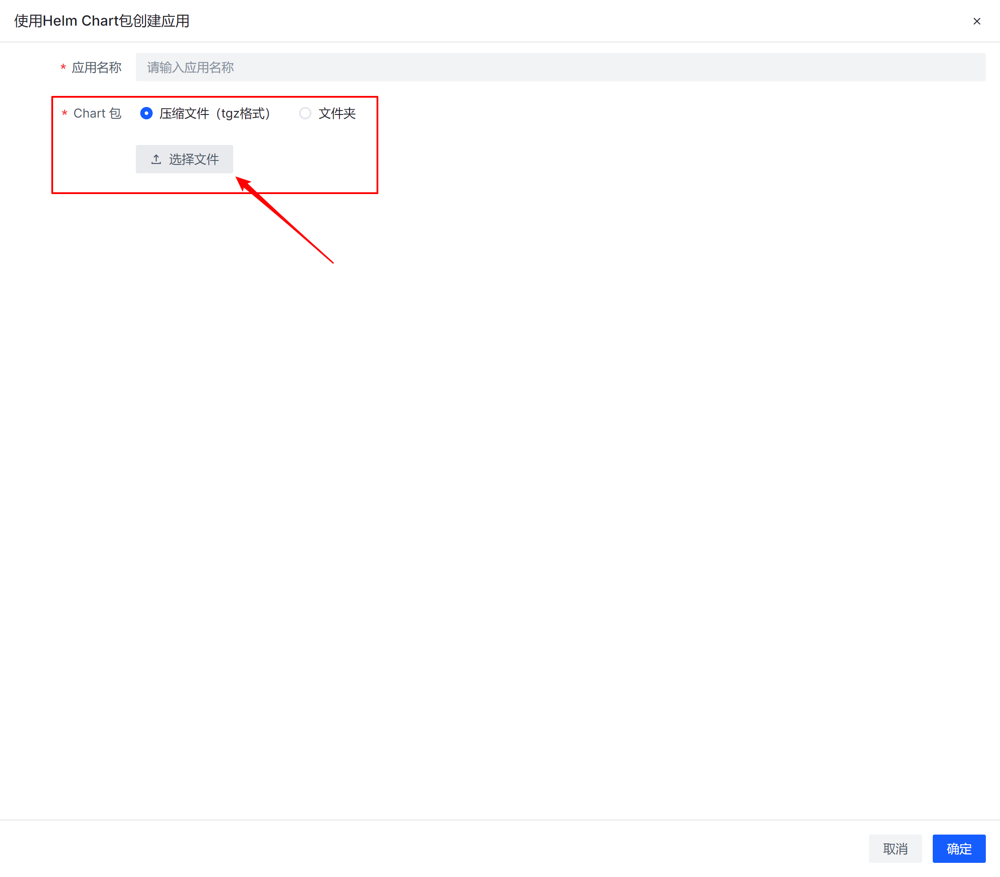
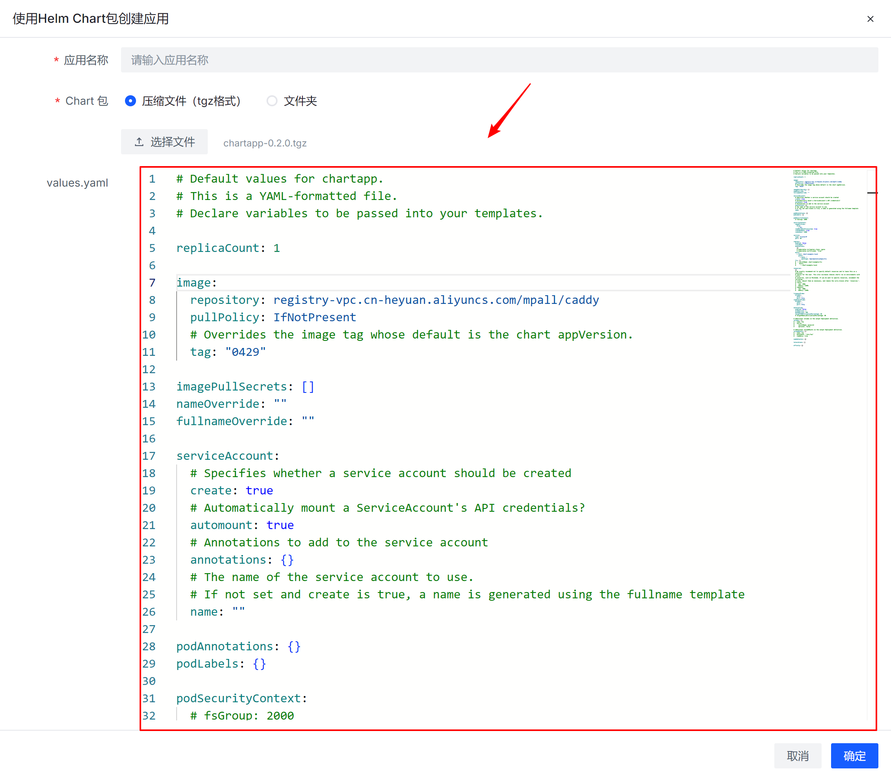
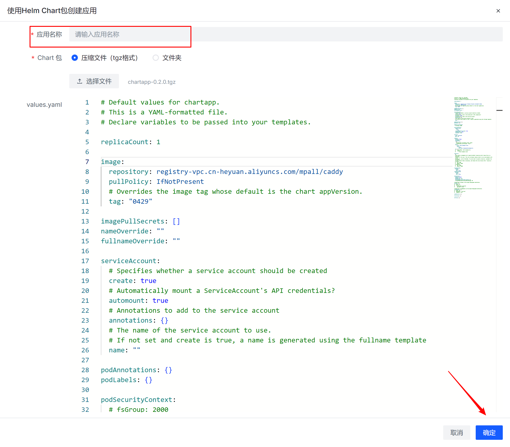

WeKube支持两种方式部署Helm chart应用。

## 一、通过Web UI部署

1. 进入[我的应用](https://wekube.com/zh-Hans/application/list)。

2. 点击【部署】按钮。

3. 选择使用【Helm chart包】。

   

4. 选择chart包。

   

   

5. 修改values.yaml配置。

   

6. 输入应用名称，点击提交。

   

## 二、使用helm部署

1. 创建并配置values.yaml。

2. 使用helm命令部署，

   ```shell
   helm install -f myvalues.yaml myredis ./redis
   ```

   helm instanll命令使用详情 https://helm.sh/docs/helm/helm_install/。
