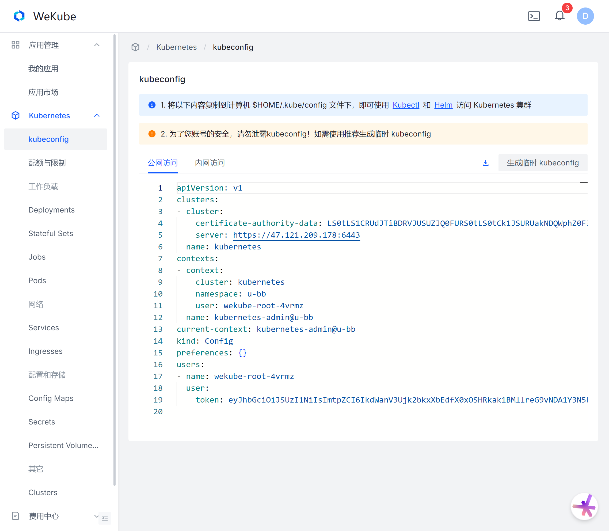
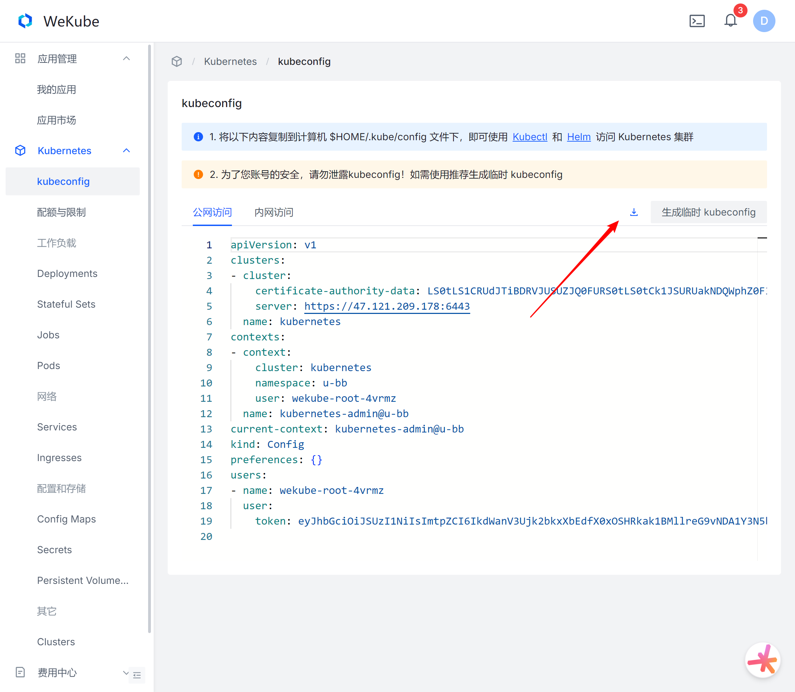

> 在使用kubectl和helm前需要先配置kubeconfig。

## 下载kubeconfig文件

首先进入[kubeconfig页面](https://wekube.com/zh-Hans/kubernetes/kubeconfig)。



然后点击右上角的下载按钮进行下载。

:::tip[提示]

为了降低泄露kubeconfig带来的风险，建议使用临时kubeconfig

:::




## 安装文件

将下载的kubeconfig文件移动到$HOME/.kube/config。

:::tip[提示]

kubectl默认会从$HOME/.kube目录下查找文件名为 config 的文件，也能通过设置环境变量 KUBECONFIG 或者通过设置去指定其它 kubeconfig 文件

:::

## 验证配置

使用 `kubectl` 命令来验证你是否能够连接到集群

```shell
kubectl get role
```

如果一切正常，你应该会看到Role输出。如果遇到任何问题，请检查你的 `kubeconfig` 文件中的配置是否正确。


## 注意事项

- 请保护好你的 `kubeconfig` 文件，因为它包含了敏感信息。
- 如果你有多个 `kubeconfig` 文件，可以通过在命令行中使用 `--kubeconfig` 参数来指定使用哪一个文件。
- 保持 `kubectl` 和你的 `kubeconfig` 文件是最新的，以获得最佳的安全性和功能支持。